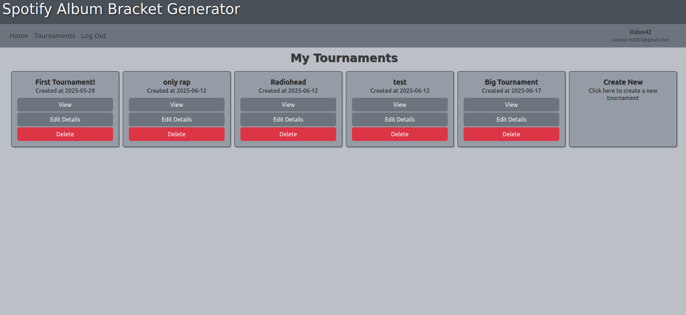
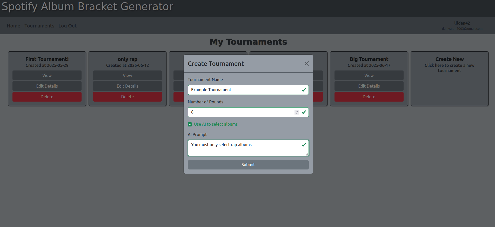
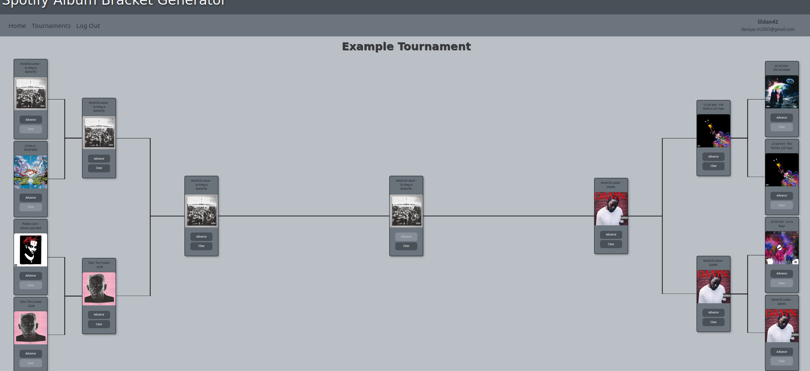

# Spotify Album Bracket Generator Frontend 🎶🏆

This frontend powers a web app that lets users log in with Spotify, fetch their saved albums, and generate single-elimination tournament brackets. Built with Vite ⚡ and React ⚛️.

## Features ✨

- 🔐 Authenticates users via Spotify OAuth and retrieves their saved albums as bracket contestants.  
- 🤖 Integrates Gemini API (`gemini-2.0-flash-lite` model) to let users apply themes or constraints to album selection.  
- 🖱️ Provides an intuitive UI to select round winners, with results synced to the backend via API.

## Screenshots 📷

**Tournament List Page**  

**Tournament Generation Options with Sample AI Prompt**  

**Example Tournament Bracket**  

## Setup 🛠️

1. 📋 Copy `template.env` to `.env` and fill in required environment variables.
2. 📦 Run `npm install` to install dependencies

> **Note:**  
> When developing locally, ensure the app runs on `127.0.0.1` (not `localhost`).  
> This is required because Spotify OAuth, CORS, and SameSite cookie policies treat `localhost` and `127.0.0.1` as different origins.  
> Using `127.0.0.1` avoids authentication issues and ensures cookies and API requests work correctly during development.

## Scripts 📜

- `npm run dev`: 🚀 Start the app in development mode with auto-reload.
- `npm run build`: 🏗️ Compile the Vite app to the `dist` directory.